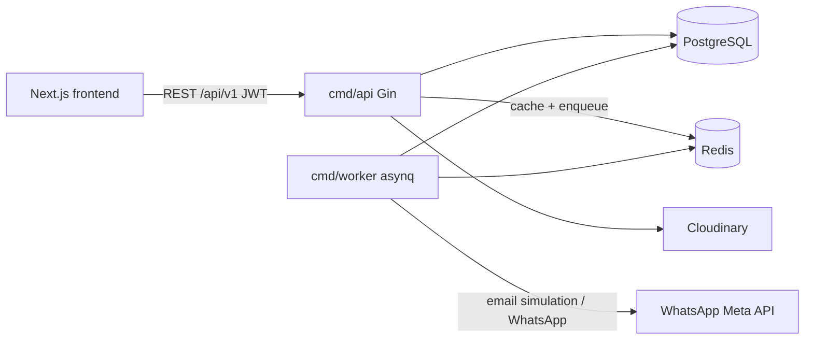
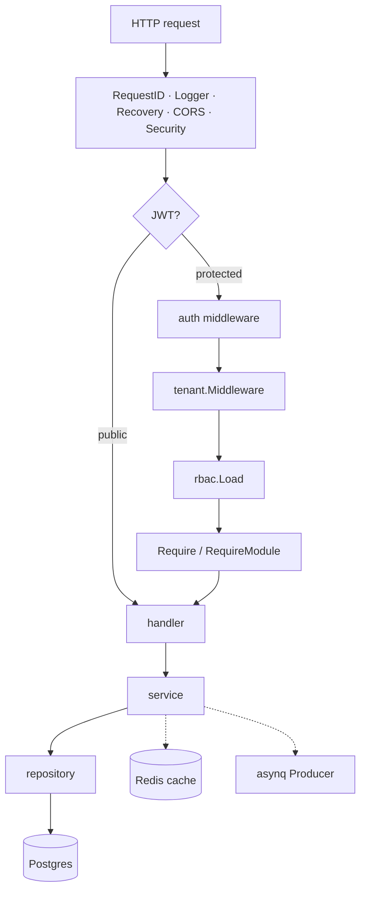

# Architecture

CRM Lite is a multi-tenant, metadata-driven CRM with a Go/Gin API, a separate
asynq worker, PostgreSQL as the system of record, and Redis for cache + queues.

## System context



## Processes

| Binary | Role | Postgres | Redis |
| --- | --- | --- | --- |
| `cmd/api` | HTTP API, enqueues jobs, Redis cache | ✓ | ✓ |
| `cmd/worker` | Import / export / notification consumers | ✓ | ✓ |
| `cmd/migrate` | Schema migrations (embedded SQL) | ✓ | |
| `cmd/seed` | Idempotent demo / catalog data | ✓ | |

API and worker scale independently. Never run migrations from the API process.

## Request path (API)



1. **Auth** — Bearer JWT → `userID` on context.
2. **Tenant** — resolve `organization_members` (+ role); cached briefly.
3. **RBAC** — load permission keys for the role; cached briefly.
4. **Handler** — bind/validate DTO, map errors to the shared envelope.
5. **Service** — business rules; may enqueue jobs or invalidate cache.
6. **Repository** — SQL via pgx.

## Vertical slices

Each feature lives under `backend/internal/<feature>/`:

```text
internal/lead/
  module.go          # composition root + RegisterRoutes
  handler/
  service/
  repository/
  dto/
  entity/
```

Cross-cutting packages (not feature slices): `tenant`, `rbac`, `jobs`, `notify`,
`shared/*`, `docs`, `seed`.

## Two storage strategies

| Strategy | Where data lives | Examples |
| --- | --- | --- |
| `native` | First-class tables | leads, contacts, tasks |
| `dynamic` | `records.data` JSONB | company, deal (seeded), custom modules |

Metadata (`modules`, `fields`, `validation_rules`, `views`) describes both.
The record runtime, import, and export APIs require `storage_strategy = dynamic`.

## Caching (Phase 17)

Shared package `internal/shared/cache`:

| Key | TTL | Invalidated |
| --- | --- | --- |
| `dashboard:{userID}` | 5m | Lead / task CUD |
| `tenant:membership:{userID}` | 2m | Short TTL |
| `rbac:perms:{roleID}` | 2m | Permission matrix change |
| `rbac:module:{roleID}:{moduleID}` | 2m | Module ACL change |
| `rbac:field:{roleID}:{moduleID}` | 2m | Field ACL change |

Cache miss or Redis failure always falls through to Postgres.

## Async queues

| Queue | Weight | Job types |
| --- | --- | --- |
| `critical` | 6 | `notification.send`, `email.send`, `whatsapp.send` |
| `default` | 3 | `lead.created`, `lead.status_changed` |
| `bulk` | 1 | `import.process`, `export.process` |

`Producer.Publish` applies MaxRetry + Timeout via `DefaultOpts`.

## Multi-tenancy & RBAC

- Every org-scoped row carries `organization_id`.
- Membership is `organization_members` (user → org + role).
- Permissions: catalog `permissions` + `role_permissions`.
- Optional ACL: `role_module_access`, `role_field_access` (absence = unrestricted
  for that layer; global permission still applies).

## Frontend

Next.js App Router under `frontend/app/(dashboard)/` with feature modules in
`frontend/features/*`. Calls the API with `NEXT_PUBLIC_API_URL`.

## Related docs

- [ERD](./erd.md)
- [Sequence diagrams](./sequences.md)
- [Developer onboarding](./developer-onboarding.md)
- OpenAPI: `/api/v1/docs`
