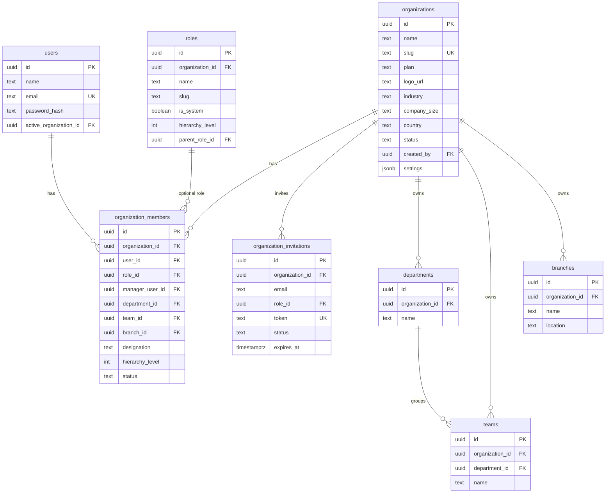
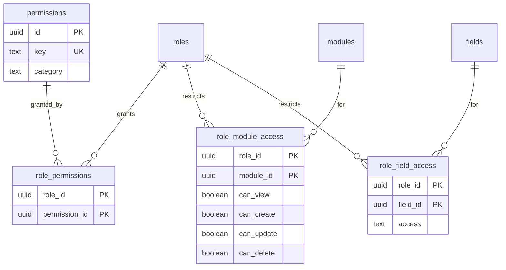
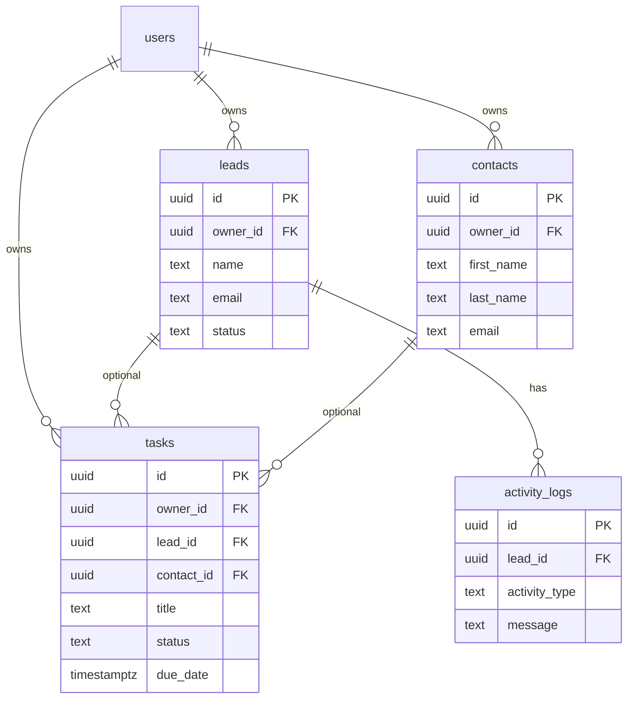
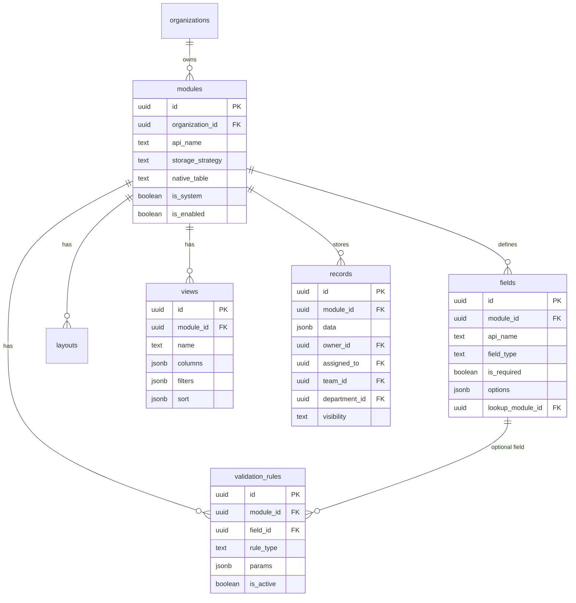
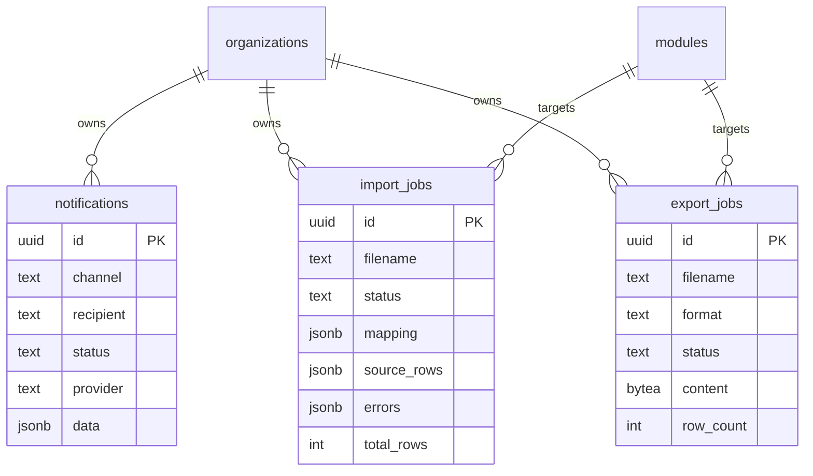
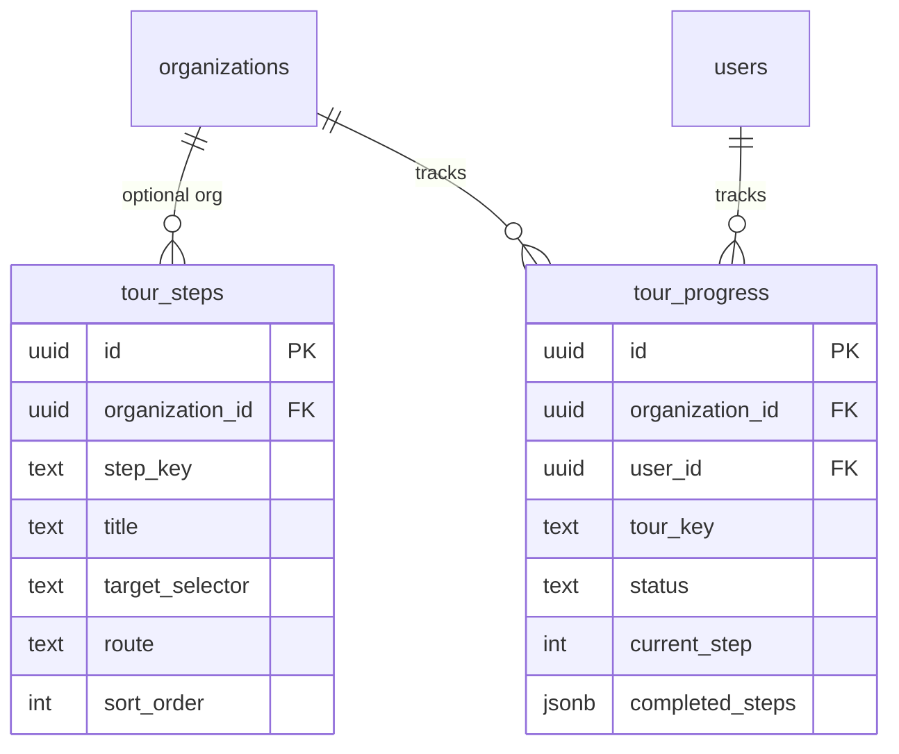

# Entity-relationship diagrams

PostgreSQL schema from migrations `000001`–`000011`. Diagrams use Mermaid ER
syntax (render in GitHub / most Markdown previewers).

## Identity & tenancy

## RBAC

`access` ∈ `hidden` | `read` | `write`. No ACL row ⇒ unrestricted at that layer.

## Native CRM

Polymorphic side-tables (no FK to leads/contacts/tasks — keyed by
`entity_type` + `entity_id`):

| Table | Purpose |
| --- | --- |
| `notes` | Free-text notes |
| `call_logs` | Call direction / status / duration |
| `attachments` | Cloudinary metadata |
| `activities` | Audit trail (`action`, `metadata` JSONB) |

## Metadata engine

`visibility` ∈ `private` | `owner` | `manager` | `hierarchy` | `department` | `organization` | `team` | `public`.

`storage_strategy`:

- `native` — data in a first-class table (`native_table`)
- `dynamic` — data in `records.data` (GIN-indexed)

Also present: `layouts`, `automation_rules`, `import_templates`, `export_templates`.

## Jobs & notifications

Statuses: import/export `pending` → `processing` → `completed` | `failed`;
notifications `queued` → `sent` | `failed`.

## Tour

## Indexes of note (Phase 17)

- `records (organization_id, module_id, created_at DESC)`
- `notifications (organization_id, created_at DESC)`
- GIN on `records.data` (`jsonb_path_ops`)

See `backend/migrations/` for the authoritative SQL.
