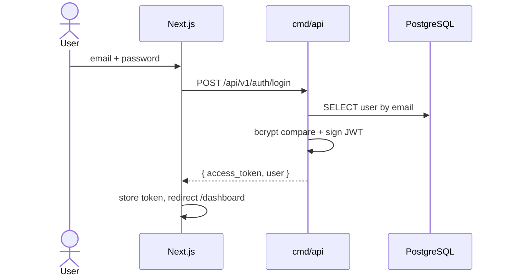
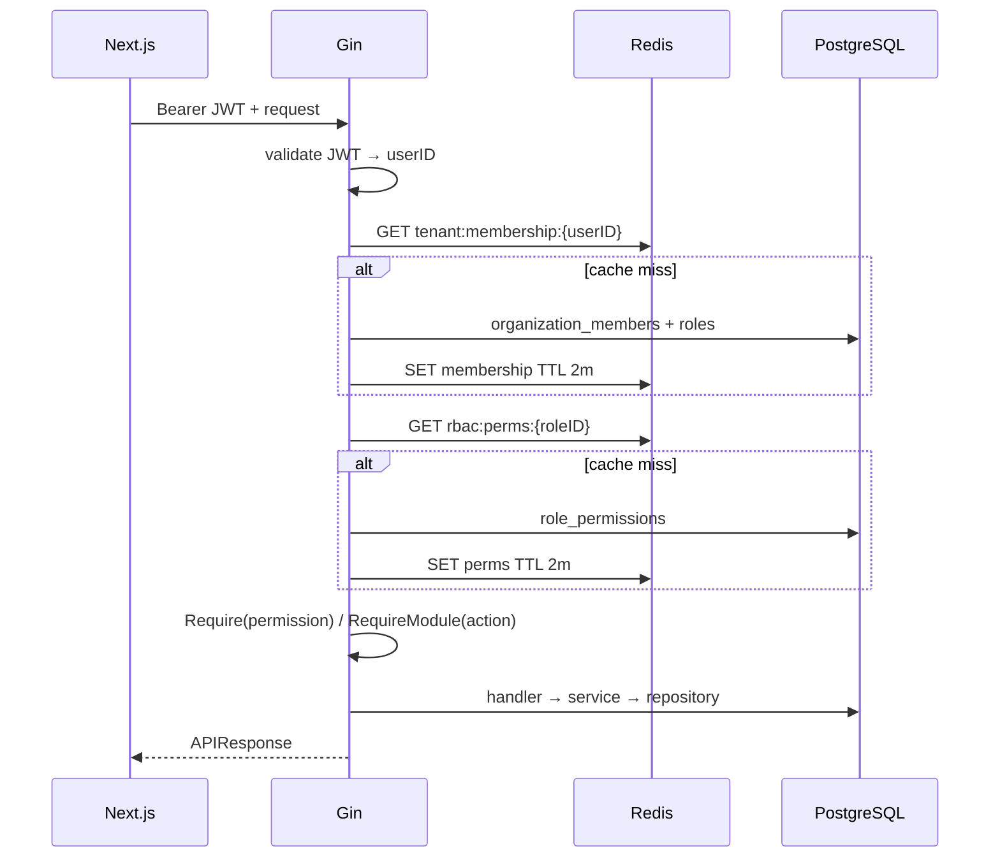
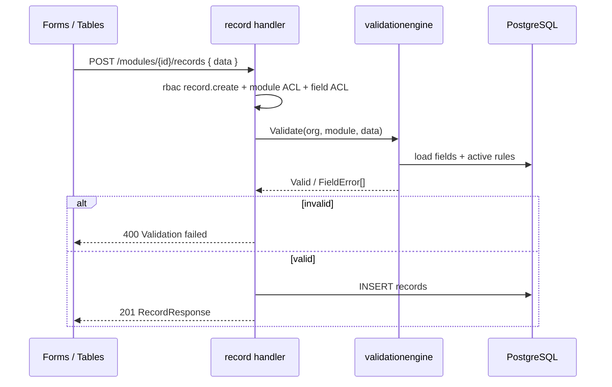
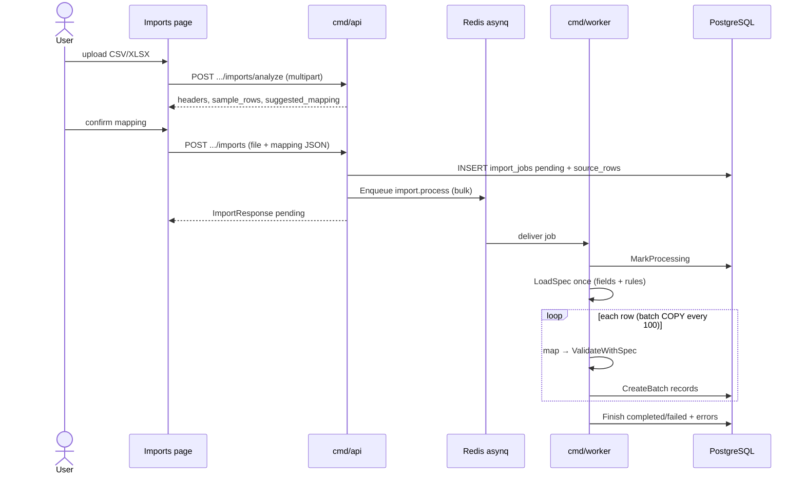
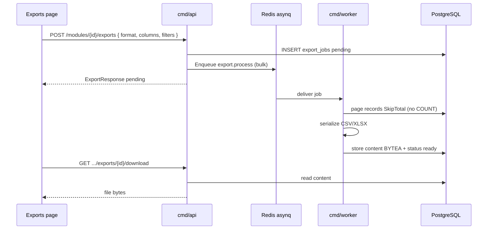
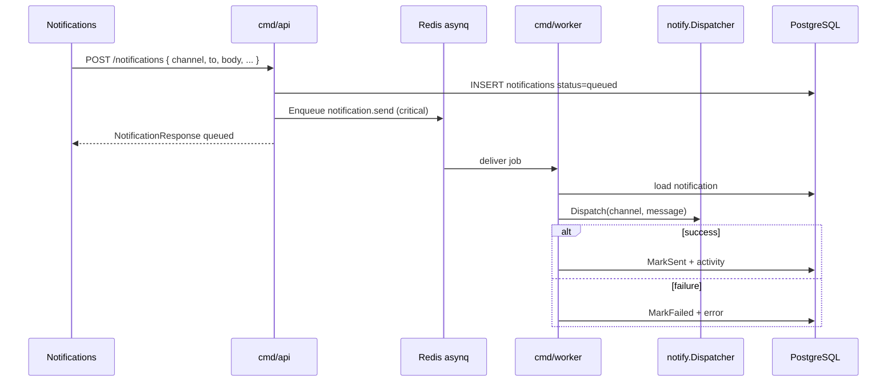
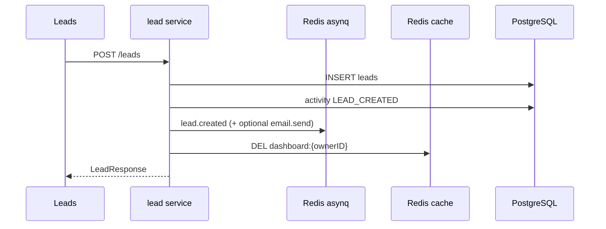

# Sequence diagrams

Happy-path flows for the critical subsystems. Error branches follow the shared
API envelope (`success: false`, optional `errors`).

## Login

## Authenticated org-scoped request

## Dynamic record create (with validation)

## Import (analyze → create → worker)

## Export (async)

Sync alternative: `GET /modules/{id}/export` builds and streams immediately
(no job row).

## Notification send

Providers: email is simulation in the default worker wiring; WhatsApp uses Meta
Cloud API when `WHATSAPP_PROVIDER=meta` and credentials are set, otherwise
simulation.

## Lead create → dashboard invalidate

## Related

- [Architecture](./architecture.md)
- [Import / export guide](./import-export-guide.md)
- [Automation guide](./automation-guide.md)
